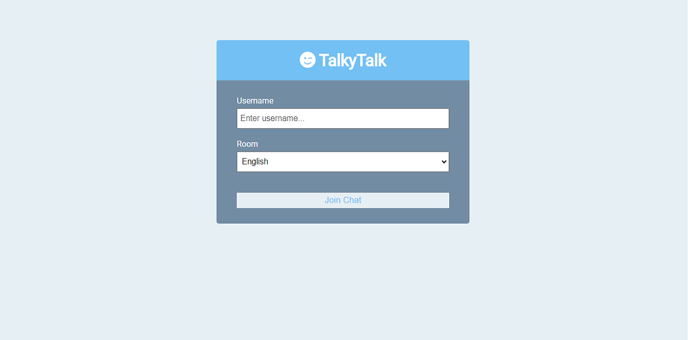
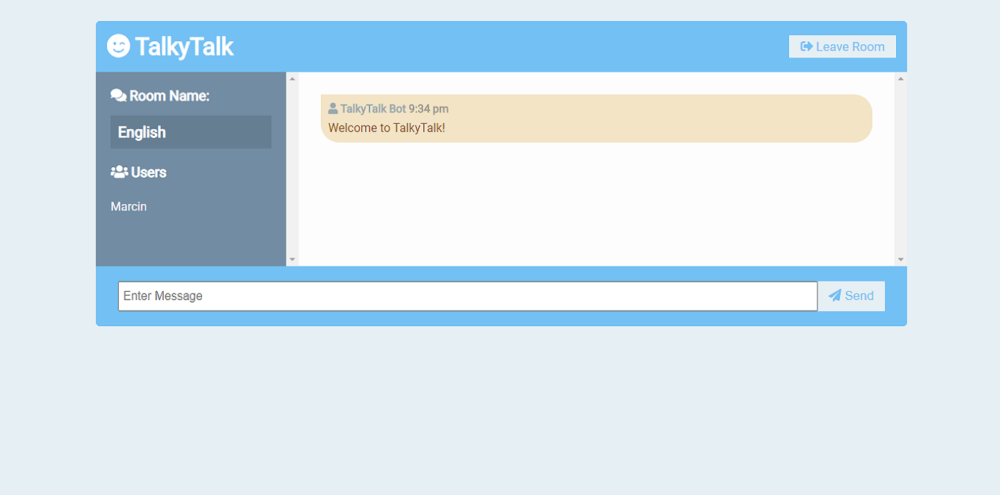
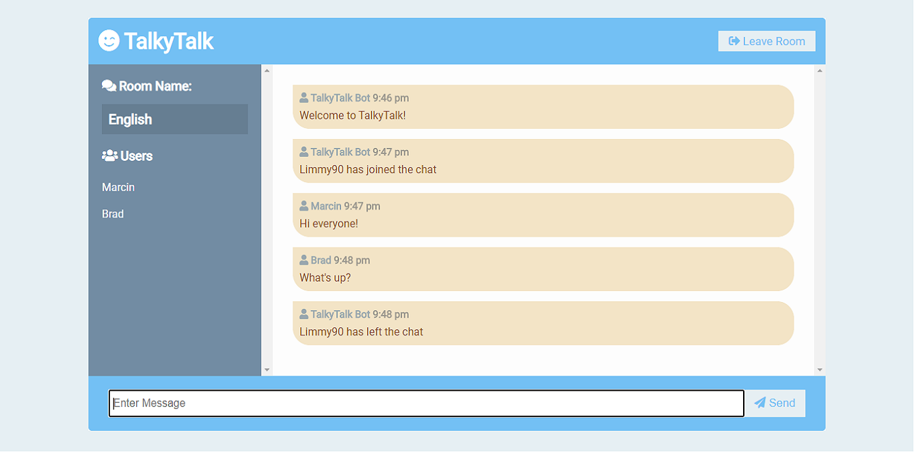
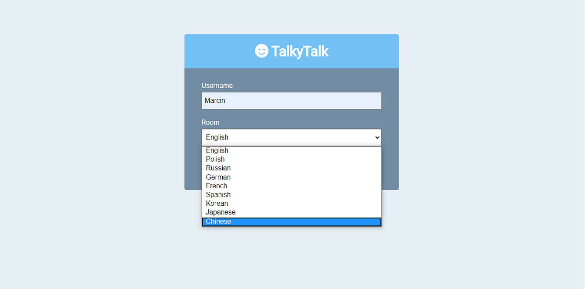
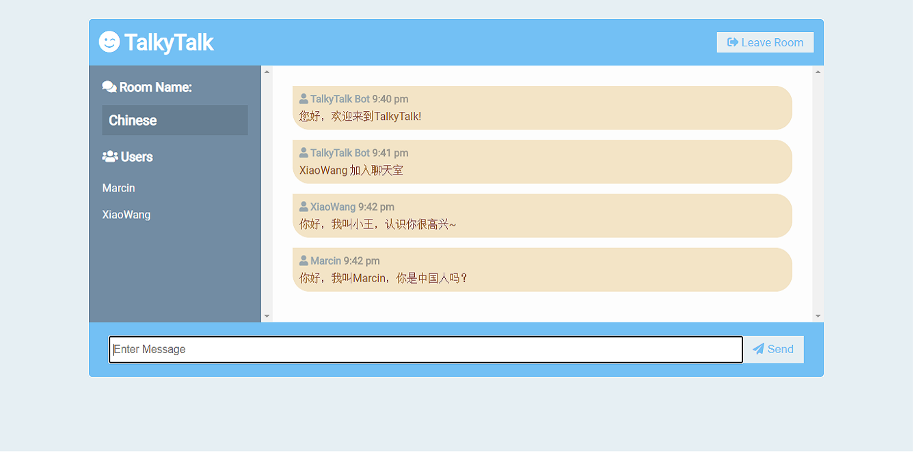

# TalkyTalk

Building a realtime chat application with users and rooms. This project uses HTML, CSS, Socket.io, Node.js & Express technologies.

**Heroku**
-------------------------------
This app has been deployed to Heroku:

https://talkytalk-chat.herokuapp.com/

-----

|   Description   |   Image    |
|:------------:|:----------------:|
|User chooses nickname and chat room.| |
|User joins the chat room.| |
|Each room can be used by multiple users at the same time.| |
|User can join one of the nine available rooms.| |
|Each room is designed for different language speakers. After joining in, user gets notifications in corresponding language.| |

-----

